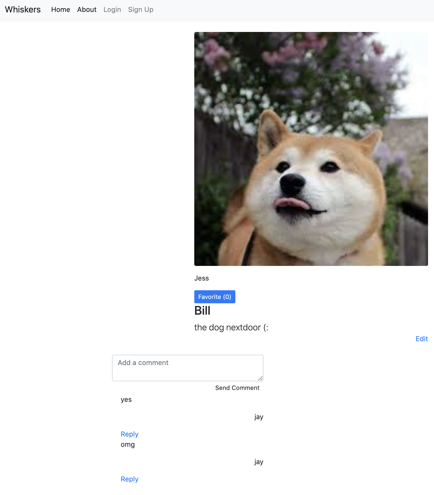

# Whisker Meets   

<!-- TABLE OF CONTENTS -->
<details open="open">
  <summary>Table of Contents</summary>
  <ol>
    <li>
      <a href="#about-the-project">About The Project</a>
      <ul>
        <li><a href="#built-with">Built With</a></li>
      </ul>
    </li>
    <li>
      <a href="#getting-started">Getting Started</a>
      <ul>
        <li><a href="#prerequisites">Prerequisites</a></li>
        <li><a href="#installation">Installation</a></li>
      </ul>
    </li>
    <li><a href="#roadmap">Roadmap</a></li>
    <li><a href="#contributing">Contributing</a></li>
    <li><a href="#license">License</a></li>
    <li><a href="#contact">Contact</a></li>
    <li><a href="#acknowledgements">Acknowledgements</a></li>
  </ol>
</details>


<!-- ABOUT THE PROJECT -->
## About The Project



Whisker Meets Whisker is a web platform that connects dog owners based on location. Users are able to setup playdates and hangouts for their dogs and leave reviews and comments about interactions with various dogs in the neighborhood.

<!-- GETTING STARTED -->
## Getting Started

To get a local copy up and running follow these simple example steps.

### Installation

1. Download or clone this repo 
    ```bash
    $ git clone git@github.com:ellojess/whisker-meets-js.git
    ```

2. `cd` into the project folder and open it in your chosen text editor (or use `code .` to open it in Visual Studio Code
    ```bash
    $ cd whisker-meets-js

    $ docker-compose up
    ```
  
<!-- ROADMAP -->
## Roadmap

See the [open issues](https://github.com/ellojess/whisker-meets-js/issues) for a list of proposed features (and known issues).

<!-- CONTRIBUTING -->
## Contributing

Contributions are what make the open source community such an amazing place to be learn, inspire, and create. Any contributions you make are **greatly appreciated**.

1. Fork the Project
2. Create your Feature Branch (`git checkout -b feature/AmazingFeature`)
3. Commit your Changes (`git commit -m 'Add some AmazingFeature'`)
4. Push to the Branch (`git push origin feature/AmazingFeature`)
5. Open a Pull Request using this [template](https://github.com/embeddedartistry/templates/blob/master/oss_docs/PULL_REQUEST_TEMPLATE.md)

### Possible Contributions 
- [ ] Add a new feature (ex: hangouts log, user profiles)
- [ ] Make the project cross platform
- [ ] New UI 

<!-- LICENSE -->
## License

Distributed under the MIT License. See `LICENSE` for more information.

<!-- CONTACT -->
## Contact

Jessica Trinh - [@ellojesss](https://twitter.com/ellojesss) - jtjessicatrinh@gmail.com

Project Link: [https://github.com/ellojess/whisker-meets-js](https://github.com/ellojess/whisker-meets-js)

<!-- ACKNOWLEDGEMENTS -->
## Acknowledgements
* [Docker](https://www.docker.com/)
* [NodeJS](https://nodejs.org/en/)
* [MongoDB](https://www.mongodb.com/3)
* [Express](https://expressjs.com/)
* [npm](https://www.npmjs.com/)


### Uptime monitored by [FreshPing](https://statuspage.freshping.io/49330-whiskersstatuspage) 
